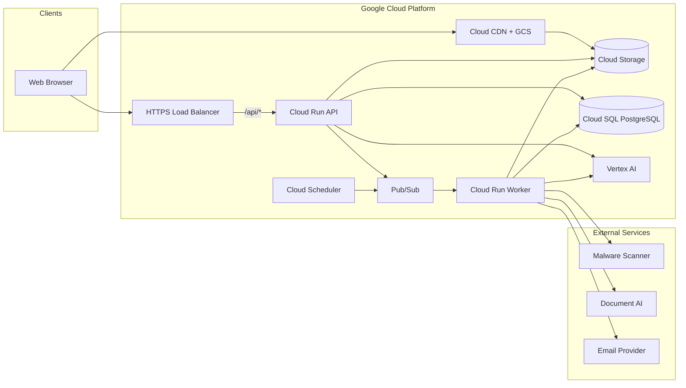
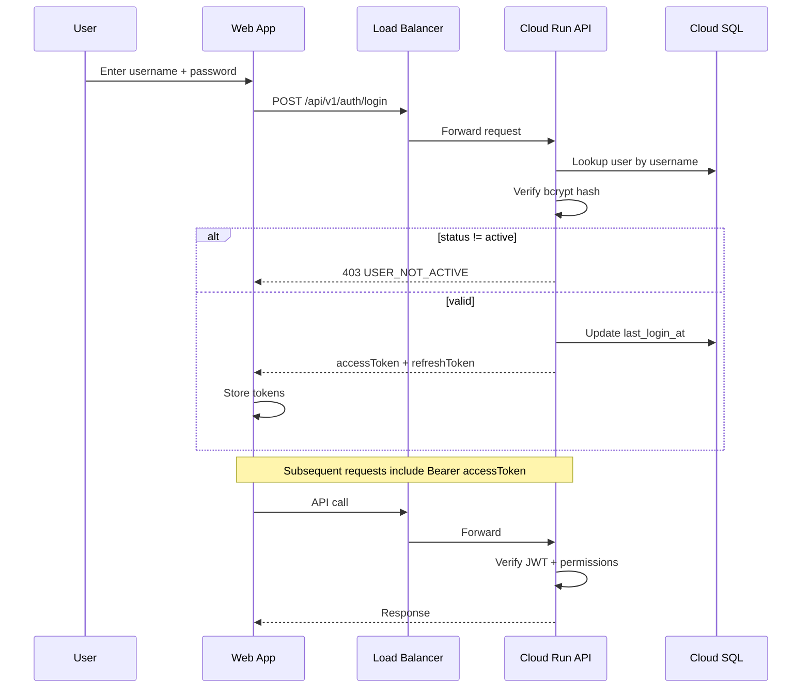
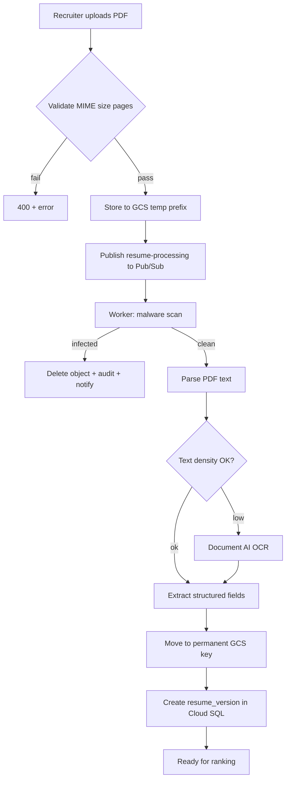

# HireSphere — Architecture

System context, data flows, and integration boundaries for HireSphere.

**Deployment:** Google Cloud Platform. See [gcp-infrastructure.md](./gcp-infrastructure.md) for full infra detail.

---

## 1. System Context



**Out of scope:** Hubble SSO (login). Hubble appears only as an optional `hubble_id` field on offers.

---

## 2. Layered Architecture

| Layer | Responsibility |
|---|---|
| **Presentation** (`apps/web`) | React SPA, app shell, forms, dashboards → GCS + CDN |
| **API** (`apps/api`) | REST handlers, auth, validation, orchestration → Cloud Run |
| **Workers** (`services/worker`) | Async jobs: resume pipeline, AI batch, exports → Cloud Run |
| **Domain** (`packages/shared`) | Types, Zod schemas, state machines, platform adapters |
| **Data** (`packages/db`) | Drizzle schema, queries, migrations → Cloud SQL |
| **AI** (`packages/ai-prompts`) | Versioned templates; invoked via Vertex AI SDK |
| **IaC** (`infra/terraform`) | GCP resource provisioning |

No business logic in React beyond presentation; all enforcement server-side.

---

## 3. Authentication Flow



Tokens: short-lived access JWT (claims: `sub`, `roles[]`, `permissions[]`); refresh token stored hashed server-side or in httpOnly cookie.

---

## 4. Resume Ingest Pipeline



Upload is synchronous; processing is async via Pub/Sub with status polling.

---

## 5. Recruitment Pipeline State Machine

Candidate stage on a posting (`candidate_posting_links.stage`):

```
applied → shortlisted → interview_scheduled → interviewed
  → scorecard_pending → scorecard_approved → priority_selected
  → offered → hired | rejected | withdrawn
```

| Stage transition | Feature | Guard |
|---|---|---|
| → shortlisted | 10 | Reason required |
| → interview_scheduled | 11 | Task created |
| → interviewed | 12 | Round completed |
| → scorecard_* | 13–14 | Interview completed |
| → priority_selected | 15 | Max 5 for finite posting |
| → offered | 16 | Scorecard approved (configurable) |
| → hired | 16 | Offer accepted; may trigger closure (17) |

---

## 6. AI Invocation Pattern

All AI features follow the same pattern:

1. Resolve active prompt from `prompt_registry` by name
2. Create `ai_runs` row (`status = queued`)
3. Publish to `ai-ranking` Pub/Sub topic (or call Vertex AI inline for small requests)
4. Worker calls **Vertex AI Gemini** with pinned `model_version`
5. Store output in `ai_run_outputs` + feature table
6. Expose feedback UI → `POST /ai-runs/:id/feedback`

| Feature | Prompt name | Primary input |
|---|---|---|
| JD drafting | `jd_draft` | Title, bullets, department |
| Ranking | `candidate_rank` | JD + resume JSON |
| Fitment / gaps | `fitment_summary`, `gap_summary` | JD + resume JSON |
| Interview Qs | `interview_questions` | JD + resume + gaps |
| Scorecard | `scorecard_draft` | Interview notes AI JSON + JD |

---

## 7. Authorization Model

```
User → user_roles → role_permissions → permissions (resource:action)
                              ↓
                    page_action_matrix (UI gating)
```

- API: `requirePermission('candidates:upload')` on handler
- UI: hide nav/routes if missing `page_action_matrix` entry (defense in depth only)
- Admin bypass: `admin:access` implies all permissions (implement in middleware)

---

## 8. Observability

| Signal | Storage | Retention |
|---|---|---|
| User actions | `audit_events` (Cloud SQL) | Configurable; default 2 years |
| AI invocations | `ai_runs` + Cloud Logging | 1 year |
| Resume processing | `candidate_history` + file status columns | Indefinite |
| Exports | `report_exports` + GCS lifecycle (90 days) | 90 days |
| App logs | Cloud Logging | 30 days default |
| Errors | Error Reporting | Auto-grouped |

Structured logs from Cloud Run include `requestId`, `actorId`, `durationMs`, `trace` (Cloud Trace).

---

## 9. Deployment Topology

| Environment | GCP Project | Database | Deploy trigger |
|---|---|---|---|
| dev | `hiresphere-dev` | Cloud SQL db-f1-micro | Manual `terraform apply` |
| staging | `hiresphere-staging` | Cloud SQL db-g1-small | Merge to `main` |
| prod | `hiresphere-prod` | Cloud SQL HA | Tag `v*` + manual approval |
| local | — | Docker Postgres | `docker compose up` |

Feature flags: not required for v1; ship behind RBAC permissions instead.

---

## 10. Security Boundaries

| Asset | Protection |
|---|---|
| Passwords | bcrypt; never log |
| JWT secrets | Secret Manager → Cloud Run env |
| Resume PDFs | Private GCS bucket; V4 signed URLs; no public access |
| PII | Role-based export redaction |
| AI prompts | Admin-only edit; versioned audit trail |
| Infected files | Deleted immediately from GCS; metadata retained |
| Cloud SQL | Private IP only; SSL required; no public endpoint |
| API | Cloud Armor rate limit on `/api/v1/auth/login` (prod) |
