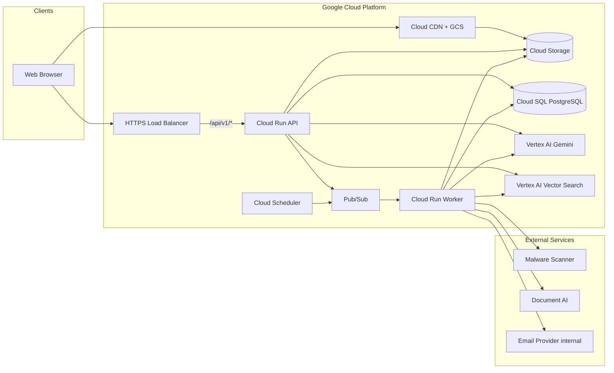
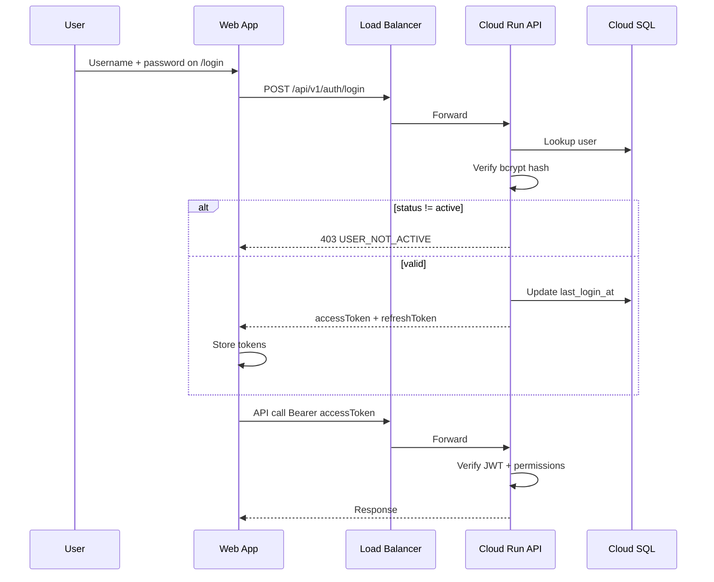
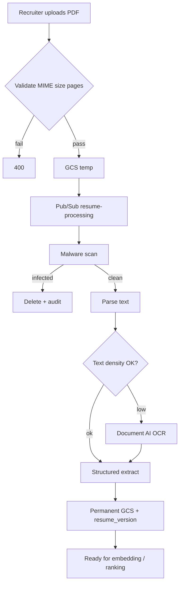

# HireSphere — Architecture

System context, data flows, and integration boundaries for HireSphere.

**Deployment:** Google Cloud Platform. See [gcp-infrastructure.md](./gcp-infrastructure.md).  
**Feature domains:** [product-architecture.md](./product-architecture.md).

---

## 1. System Context



**Out of scope for login:** Hubble SSO. Auth is HireSphere username + password (JWT + bcrypt).  
`hubble_id` on offers is an optional external employee reference only.

---

## 2. Layered Architecture

| Layer | Responsibility |
|---|---|
| **Presentation** (`apps/web`) | React SPA, design system shell, forms, dashboards → GCS + CDN |
| **API** (`apps/api`) | REST, auth, RBAC, orchestration, AI gateway entry → Cloud Run |
| **Workers** (`services/worker`) | Resume pipeline, embeddings, ranking, exports, notifications → Cloud Run |
| **Domain** (`packages/shared`) | Types, Zod, state machines, `StorageProvider` / `JobQueue` / `AIProvider` |
| **Data** (`packages/db`) | Drizzle schema, migrations → Cloud SQL |
| **AI** (`packages/ai-prompts`) | Versioned templates; resolved via `prompt_registry` |
| **IaC** (`infra/terraform`) | GCP provisioning |

No business logic in React beyond presentation; all enforcement server-side.

### Product domains (see product-architecture.md)

Identity & access · AI platform governance · Design system · Hiring & postings ·
Candidate intake · Matching & ranking · Interview pipeline · Decision & offers ·
Insight & reporting · Communications

---

## 3. Authentication Flow (HireSphere-owned)

Custom branded `/login` — **not** Hubble or third-party SSO.



Tokens: short-lived access JWT (`sub`, `roles[]`, `permissions[]`); refresh rotated and stored hashed server-side or httpOnly cookie.

---

## 4. Domain spine — Application

Stage and hiring progress attach to **Application** (candidate × posting), not to Candidate alone.
A candidate may be at different stages on different postings simultaneously.

```
Candidate ──1:N──▶ Application ──▶ RankingScore / Shortlist / InterviewRounds
                         │              Scorecard / PrioritySlot / Offer
                         │
                         └── resume_version_ref + posting_ref
```

**MatchSuggestion** (Communications): lighter than Application; promoted to Application only when a human acts — keeps resurfacing from inflating pipeline metrics.

---

## 5. Resume Ingest Pipeline (Candidate intake)



---

## 6. Matching and ranking

1. Worker embeds resume sections → Vertex AI Vector Search (`vector_index_records`).
2. On rank: retrieve neighbors with **query-time** RBAC filters (never bake permission verdicts into vectors).
3. LLM ranks via AI gateway (`candidate_rank`, `fitment_summary`, `gap_summary`, `interview_questions`).
4. Persist `RankingScore` with full provenance tuple:

```
RankingScore = f(resume_version, jd_version, prompt_template_version, model_version)
```

Vector store is for retrieval; **Cloud SQL remains source of truth**.

---

## 7. Recruitment Pipeline State Machine

Application stage:

```
applied → shortlisted → interview_scheduled → interviewed
  → scorecard_pending → scorecard_approved → priority_selected
  → offered → hired | rejected | withdrawn
```

| Transition | Domain | Guard |
|---|---|---|
| → shortlisted | Interview pipeline | Reason required |
| → interview_scheduled | Interview pipeline | Task created |
| → interviewed | Interview pipeline | Round completed |
| → scorecard_* | Interview pipeline | Interview completed; human approve |
| → priority_selected | Decision & offers | Max 5 for finite |
| → offered / hired | Decision & offers | Scorecard / offer rules |
| posting closed | Decision & offers | Vacancy filled or manual |

---

## 8. AI Invocation Pattern (AI platform governance)

1. Resolve active prompt from `prompt_registry`
2. Create `ai_runs` row **before** provider call (`queued`)
3. Publish to Pub/Sub or call Vertex for small requests
4. Worker invokes Gemini with pinned `model_version`
5. Store outputs; expose feedback UI
6. **Advisory-only:** gateway and workflow refuse AI-triggered hiring transitions

---

## 9. Authorization Model (Identity & access)

```
User → user_roles → role_permissions → permissions (resource:action)
                              ↓
                    page_action_matrix (UI gating only)
```

- API: `requirePermission(...)` on every protected handler
- UI hide is defense-in-depth only
- Optional: permission explanation endpoint; break-glass for admin PII (audited, time-boxed)

---

## 10. Communications

| Channel | v1 policy |
|---|---|
| In-app + email to HireSphere users | Enabled (interview tasks, resurfacing alerts) |
| Candidate-facing email | Gated — not open until product/legal unlock |
| Calendar | Stub / optional later integration |
| Resurfacing + priority lane | MatchSuggestion → human promote to Application |

---

## 11. Observability

| Signal | Storage | Retention |
|---|---|---|
| User actions | `audit_events` | Default 2 years |
| AI invocations | `ai_runs` + Cloud Logging | 1 year |
| Resume processing | history + status columns | Indefinite |
| Exports | `report_exports` + GCS | 90 days |
| App logs | Cloud Logging | 30 days |

Structured logs: `requestId`, `actorId`, `durationMs`, Cloud Trace.

---

## 12. Deployment Topology

| Environment | GCP Project | Deploy trigger |
|---|---|---|
| dev | `hiresphere-dev` | Manual `terraform apply` |
| staging | `hiresphere-staging` | Merge to `main` |
| prod | `hiresphere-prod` | Tag `v*` + manual approval |
| local | — | `docker compose up` |

---

## 13. Security Boundaries

| Asset | Protection |
|---|---|
| Passwords | bcrypt; never log |
| JWT secrets | Secret Manager |
| Resume PDFs | Private GCS; V4 signed URLs |
| PII | Role-based export redaction |
| AI prompts / runs | Admin governance; versioned audit |
| Vectors | Query-time auth; no public index |
| Cloud SQL | Private IP; SSL |
| Login | Rate limit + Cloud Armor (prod) |
