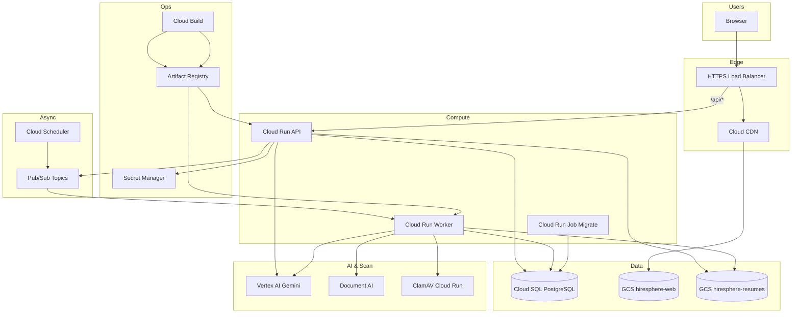

# HireSphere — GCP Infrastructure & Deployment

Deployment target: **Google Cloud Platform**. This document defines environments, services, networking, CI/CD, and the infrastructure feature branches that provision them.

Related: [architecture.md](./architecture.md) · [implementation-plan.md](./implementation-plan.md) · [feature-branches.md](./feature-branches.md) · [../openspec/project.md](../openspec/project.md)

---

## 1. GCP Service Map

| Concern | GCP Service | Notes |
|---|---|---|
| Frontend (SPA) | **Cloud Storage** + **Cloud CDN** + **HTTPS Load Balancer** | Static Vite build; cache-busted assets |
| REST API | **Cloud Run** (`hiresphere-api`) | Containerized Node.js (Fastify/Hono); scales to zero in non-prod |
| Background workers | **Cloud Run** (`hiresphere-worker`) + **Pub/Sub** | Resume scan/parse, AI batch jobs, exports |
| Scheduled jobs | **Cloud Scheduler** → Pub/Sub | Posting closure reconcile, export cleanup |
| Database | **Cloud SQL for PostgreSQL** (v15+) | Private IP only; no public endpoint |
| Migrations | **Cloud Run Job** (`hiresphere-migrate`) | Run Drizzle migrations on deploy |
| File storage | **Cloud Storage** (`hiresphere-resumes`, `hiresphere-exports`) | Uniform bucket-level access; signed URLs |
| Secrets | **Secret Manager** | DB password, JWT secrets, API keys |
| Container images | **Artifact Registry** | `us-central1-docker.pkg.dev/...` |
| AI | **Vertex AI** (Gemini) | JD drafting, ranking, scorecards, interview Qs |
| OCR (scanned PDFs) | **Document AI** or **Cloud Vision** | Triggered when parse detects low text density |
| Malware scan | **ClamAV on Cloud Run** or vendor API | Gate before parse; infected objects deleted |
| Email | **SendGrid** / **Mailgun** (external) | Interview task notifications |
| CI/CD | **Cloud Build** + GitHub trigger | Build → test → push image → deploy |
| IaC | **Terraform** (`infra/terraform/`) | All GCP resources codified |
| Logs & metrics | **Cloud Logging**, **Cloud Monitoring**, **Error Reporting** | Structured JSON logs from API/worker |
| WAF (optional) | **Cloud Armor** on LB | Rate limiting, geo rules for prod |

---

## 2. Architecture



**Request path:**
- `https://hiresphere.example.com/*` → CDN → GCS (SPA; fallback `index.html` for client routing)
- `https://hiresphere.example.com/api/v1/*` → Load Balancer → Cloud Run API

---

## 3. Environments

| Environment | GCP Project | Purpose | Cloud SQL | Cloud Run min instances |
|---|---|---|---|---|
| `dev` | `hiresphere-dev` | Engineer sandbox | db-f1-micro, single zone | 0 |
| `staging` | `hiresphere-staging` | Pre-prod QA, integration tests | db-g1-small | 0 |
| `prod` | `hiresphere-prod` | Production | db-custom-2-8192 + HA | 1 (API), 0 (worker) |

**Naming convention:** `{service}-{env}` e.g. `hiresphere-api-staging`.

**DNS:**
- `staging.hiresphere.example.com` → staging LB IP
- `app.hiresphere.example.com` → prod LB IP

---

## 4. Repository Layout (GCP)

```
HireSphere/
├── apps/
│   ├── web/                    # React SPA → GCS
│   └── api/                    # REST API → Cloud Run
├── services/
│   └── worker/                 # Pub/Sub consumer → Cloud Run
├── packages/
│   ├── db/                     # Drizzle schema, migrations, seeds
│   ├── shared/
│   └── ai-prompts/
├── infra/
│   └── terraform/
│       ├── modules/
│       │   ├── networking/     # VPC, subnets, PSA for Cloud SQL
│       │   ├── cloud-sql/
│       │   ├── cloud-run/
│       │   ├── storage-cdn/
│       │   ├── pubsub/
│       │   ├── secrets/
│       │   └── iam/
│       └── environments/
│           ├── dev/
│           ├── staging/
│           └── prod/
├── cloudbuild.yaml             # Root pipeline
├── docker/
│   ├── api.Dockerfile
│   ├── worker.Dockerfile
│   └── migrate.Dockerfile
└── docs/
```

---

## 5. Networking & Security

### VPC
- Custom VPC per environment (`hiresphere-vpc`)
- Subnet: `10.0.0.0/20` (us-central1)
- **Private Service Access** peering for Cloud SQL private IP
- Serverless VPC Access connector for Cloud Run → Cloud SQL

### Cloud SQL
- **Private IP only** — no public IPv4
- SSL required (`sslmode=verify-full`)
- Automated backups (7-day retention dev/staging, 30-day prod)
- Point-in-time recovery enabled in prod
- Connection via Cloud SQL Auth Proxy locally; connector in Cloud Run

### Cloud Storage
| Bucket | Access | Lifecycle |
|---|---|---|
| `hiresphere-web-{env}` | Public via CDN (objects only) | — |
| `hiresphere-resumes-{env}` | Private; signed URLs (15 min TTL) | Delete `tmp/` after 1 day |
| `hiresphere-exports-{env}` | Private; signed URLs | Delete after 90 days |

### IAM (service accounts)
| SA | Used by | Roles |
|---|---|---|
| `sa-api-{env}` | Cloud Run API | `cloudsql.client`, `secretmanager.secretAccessor`, `storage.objectAdmin` (resumes/exports), `pubsub.publisher`, `aiplatform.user` |
| `sa-worker-{env}` | Cloud Run Worker | Same as API + `pubsub.subscriber` |
| `sa-migrate-{env}` | Cloud Run Job | `cloudsql.client`, `secretmanager.secretAccessor` |
| `sa-cicd-{env}` | Cloud Build | `run.admin`, `artifactregistry.writer`, `iam.serviceAccountUser` |

Principle of least privilege — no default compute SA.

### Secrets (Secret Manager)
| Secret | Rotation |
|---|---|
| `db-password` | 90 days (prod) |
| `jwt-access-secret` | On compromise |
| `jwt-refresh-secret` | On compromise |
| `sendgrid-api-key` | Vendor-driven |
| `malware-scan-api-key` | Vendor-driven |

Mounted as env vars in Cloud Run via `--set-secrets`.

---

## 6. Cloud Run Configuration

### API service (`hiresphere-api`)

```yaml
# Illustrative — actual values in Terraform
cpu: 1
memory: 512Mi
minInstances: 0        # 1 in prod
maxInstances: 10       # 50 in prod
concurrency: 80
timeout: 60s
ingress: internal-and-cloud-load-balancing
vpcAccess: connector
```

Health: `GET /api/v1/health` (checks DB connectivity).

### Worker service (`hiresphere-worker`)

```yaml
cpu: 2
memory: 1Gi
minInstances: 0
maxInstances: 5
timeout: 900s          # 15 min for AI batch / large PDFs
ingress: internal      # No public URL — Pub/Sub push only
```

### Pub/Sub topics

| Topic | Publisher | Subscriber | Payload |
|---|---|---|---|
| `resume-processing` | API (on upload) | Worker | `{ resumeFileId }` |
| `ai-ranking` | API | Worker | `{ postingId, aiRunId }` |
| `report-export` | API | Worker | `{ exportId }` |
| `posting-reconcile` | Scheduler (daily) | Worker | `{}` |

Dead-letter topic: `hiresphere-dlq` — alert on message count > 0.

---

## 7. CI/CD Pipeline

### Cloud Build (`cloudbuild.yaml`)

```mermaid
flowchart LR
    Push[Git push / PR merge] --> CB[Cloud Build]
    CB --> Lint[lint + typecheck + test]
    Lint --> Build[docker build api worker migrate]
    Build --> PushImg[push Artifact Registry]
    PushImg --> Migrate[Cloud Run Job migrate]
    Migrate --> DeployAPI[deploy Cloud Run API]
    DeployAPI --> DeployWorker[deploy Cloud Run Worker]
    DeployWorker --> Web[build SPA + sync GCS]
    Web --> Invalidate[CDN cache invalidate /*.html]
```



**Triggers:**
| Trigger | Branch | Action |
|---|---|---|
| `pr-check` | PR to `main` | Lint, test, build images (no deploy) |
| `deploy-staging` | merge to `main` | Full deploy → staging |
| `deploy-prod` | tag `v*` | Full deploy → prod (manual approval gate) |

**GitHub Actions alternative:** Run tests in GitHub; Cloud Build only for image build + deploy. Either works — pick one orchestrator.

### Deploy commands (reference)

```bash
# Staging deploy (after images pushed)
gcloud run jobs execute hiresphere-migrate-staging --region=us-central1 --wait
gcloud run services update hiresphere-api-staging --image=... --region=us-central1
gcloud run services update hiresphere-worker-staging --image=... --region=us-central1
gsutil -m rsync -r apps/web/dist gs://hiresphere-web-staging
gcloud compute url-maps invalidate-cdn-cache hiresphere-lb-staging --path="/*.html"
```

---

## 8. Infrastructure — Single Terraform Branch

All GCP infrastructure ships on **one branch**: `infra/gcp-terraform`.

This is intentional: Terraform modules depend on each other (VPC before Cloud SQL before Cloud Run), and learning Terraform is easier when you see the full graph in one PR rather than six partial branches.

### What this branch contains

| Area | Terraform module | GCP resources |
|---|---|---|
| Networking | `modules/networking` | VPC, subnet, Private Service Access, VPC connector |
| Identity | `modules/iam` | Service accounts (api, worker, migrate, cicd) + IAM bindings |
| Secrets | `modules/secrets` | Secret Manager shells + generated DB password |
| Images | `modules/artifact-registry` | Docker Artifact Registry repo |
| Database | `modules/cloud-sql` | PostgreSQL 15, private IP, backups, app user |
| Storage | `modules/storage` | GCS buckets: web, resumes, exports |
| Async | `modules/pubsub` | Topics, subscriptions, dead-letter queue, Cloud Scheduler |
| Compute | `modules/cloud-run` | API service, worker service, migrate job |
| Edge | `modules/load-balancer` | HTTPS LB, managed SSL cert, CDN, path routing |
| Ops | `modules/observability` | Uptime checks, alert policies |
| CI/CD | `modules/cicd` | Cloud Build trigger |

**Non-Terraform files on the same branch:**

- `docker/api.Dockerfile`, `docker/worker.Dockerfile`, `docker/migrate.Dockerfile`
- `cloudbuild.yaml` — build, push images, run migrate job, deploy Cloud Run, sync SPA to GCS

### Terraform layout

```
infra/terraform/
├── README.md                 # Learning guide + commands
├── modules/                  # Reusable modules (one folder per area above)
└── environments/
    ├── dev/                  # Cheapest settings — learn here first
    ├── staging/              # Pre-production
    └── prod/                 # HA SQL, min API instances, deletion protection
```

Each environment folder is a **Terraform root module** — the directory you run `terraform init/plan/apply` from.

### Terraform concepts you'll use

| Concept | File | Purpose |
|---|---|---|
| Provider | `environments/*/providers.tf` | Connects Terraform to GCP (`google` provider) |
| Backend | `environments/*/backend.tf` | Remote state in GCS bucket `gs://{project}-tfstate` |
| Variables | `environments/*/variables.tf` + `terraform.tfvars` | Per-env config (project ID, region, domain) |
| Module call | `environments/*/main.tf` | Wires modules together, passes outputs as inputs |
| Outputs | `environments/*/outputs.tf` | LB IP, Cloud SQL connection name, bucket names |

### Module dependency order (apply logic)

```
networking
    ├── cloud-sql
    ├── cloud-run
    └── load-balancer

iam ──┬── secrets
      ├── cloud-sql
      ├── storage
      ├── pubsub
      ├── cloud-run
      └── cicd

artifact-registry ── cloud-run
storage ── load-balancer
cloud-run ── load-balancer
pubsub ── cloud-run
observability, cicd (last)
```

Wire dependencies with module `outputs` → `variables`, plus `depends_on` where Terraform can't infer order (e.g. PSA before Cloud SQL).

### Learning workflow

```bash
# 1. Bootstrap state bucket (once, manual — Terraform can't create its own backend)
gsutil mb -p hiresphere-dev -l us-central1 gs://hiresphere-dev-tfstate
gsutil versioning set on gs://hiresphere-dev-tfstate

# 2. Enable GCP APIs (once per project)
gcloud services enable compute.googleapis.com run.googleapis.com sqladmin.googleapis.com \
  secretmanager.googleapis.com artifactregistry.googleapis.com pubsub.googleapis.com \
  cloudscheduler.googleapis.com cloudbuild.googleapis.com servicenetworking.googleapis.com \
  vpcaccess.googleapis.com monitoring.googleapis.com

# 3. Work through Terraform
cd infra/terraform/environments/dev
cp terraform.tfvars.example terraform.tfvars   # fill in project_id
terraform init      # download providers, connect backend
terraform validate  # syntax check
terraform plan      # preview — read every line
terraform apply     # create resources
terraform output    # see LB IP, connection names, etc.
```

**Recommended progression:** start with `dev`, run `plan`/`apply`/`destroy` cycles to build confidence, then `staging`, then `prod`.

### Suggested commits within the branch

| Commit | Modules added |
|---|---|
| 1 | `networking`, `iam`, `secrets` |
| 2 | `artifact-registry`, `cloud-sql` |
| 3 | `storage`, `pubsub` |
| 4 | `cloud-run` (placeholder images) |
| 5 | `load-balancer` |
| 6 | `observability`, `cicd`, Dockerfiles, `cloudbuild.yaml` |

### Acceptance criteria

- [ ] `terraform plan` is clean in dev, staging, prod
- [ ] `terraform apply` in staging creates all resources
- [ ] Cloud SQL has private IP only (no public endpoint)
- [ ] `GET /api/v1/health` returns 200 via load balancer
- [ ] GCS web bucket serves SPA; `/api/*` routes to Cloud Run
- [ ] Pub/Sub dead-letter topic has alerting policy
- [ ] Cloud Build trigger deploys on merge to `main`

### Application infra branches (separate from GCP)

These branches contain **application code**, not Terraform:

| Branch | Scope |
|---|---|
| `infra/monorepo-scaffold` | `apps/api`, `services/worker`, `docker-compose` for local dev |
| `infra/database-foundation` | Drizzle schema, migrations, seeds |
| `infra/design-system-app-shell` | UI shell per layout/design specs |

Merge `infra/gcp-terraform` **before** `infra/monorepo-scaffold` so deploy targets exist when app code lands.

---

## 9. Local Development

```yaml
# docker-compose.yml (local only)
services:
  postgres:
    image: postgres:15
    ports: ["5432:5432"]
  pubsub-emulator:
    image: gcr.io/google.com/cloudsdktool/cloud-sdk:emulators
    command: gcloud beta emulators pubsub start --host-port=0.0.0.0:8085
```

```bash
# Terminal 1: DB
docker compose up postgres

# Terminal 2: API
cd apps/api && pnpm dev          # connects to local Postgres

# Terminal 3: Worker (optional)
cd services/worker && pnpm dev

# Terminal 4: Web
cd apps/web && pnpm dev          # proxies /api → localhost:3000
```

Cloud SQL Auth Proxy for staging DB access (read-only debugging):

```bash
cloud-sql-proxy hiresphere-staging:us-central1:hiresphere-db-staging
```

---

## 10. AI on Vertex AI

Replace Netlify AI Gateway with Vertex AI Gemini.

| Prompt | Model (starting point) | Notes |
|---|---|---|
| JD draft | `gemini-2.0-flash` | Fast, cost-effective |
| Candidate ranking | `gemini-2.0-flash` | Batch in worker |
| Scorecard draft | `gemini-2.0-pro` | Higher quality for structured output |

- API region: `us-central1` (same as Cloud Run for low latency)
- Store `model_version` on every `ai_runs` row
- Use Vertex AI safety settings + Responsible AI feature 19 governance
- Service account needs `roles/aiplatform.user`

---

## 11. Cost Estimate (Staging, Light Usage)

Rough monthly — adjust after load testing.

| Service | Estimate |
|---|---|
| Cloud SQL db-g1-small | ~$25–40 |
| Cloud Run (API + worker, scale to zero) | ~$5–20 |
| Cloud Storage + CDN | ~$5–10 |
| Load Balancer | ~$18 (fixed) |
| Pub/Sub + Scheduler | < $5 |
| Vertex AI (low volume) | ~$10–50 |
| Secret Manager, Logging | < $10 |
| **Total staging** | **~$70–150/mo** |

Prod (HA SQL, min 1 API instance, Cloud Armor): ~$300–600/mo at moderate load.

---

## 12. Production Checklist

- [ ] Cloud SQL HA + PITR enabled
- [ ] No public Cloud SQL IP
- [ ] All buckets private except CDN-served web assets
- [ ] Cloud Armor rate limiting on `/api/v1/auth/login`
- [ ] DLQ alerting configured
- [ ] Uptime check on `/api/v1/health`
- [ ] Log-based metric for 5xx rate
- [ ] Secret rotation runbook documented
- [ ] Backup restore tested quarterly
- [ ] `prod` deploy requires manual approval in Cloud Build

---

## 13. Terraform State & Backends

**One state file per environment** — never share state between dev/staging/prod.

| Environment | GCS backend bucket | State prefix |
|---|---|---|
| dev | `gs://hiresphere-dev-tfstate` | `terraform/state` |
| staging | `gs://hiresphere-staging-tfstate` | `terraform/state` |
| prod | `gs://hiresphere-prod-tfstate` | `terraform/state` |

Enable versioning on each bucket. Bootstrap buckets manually before first `terraform init` (Terraform cannot create its own backend on first run).

Module dependency order:

```
networking → cloud-sql → secrets → pubsub → cloud-run → load-balancer → observability → cicd
```

Each module outputs IDs consumed by the next. Environment roots (`infra/terraform/environments/{dev,staging,prod}`) compose all modules in `main.tf`.

---

## 14. Migration from Netlify References

The application code should be **platform-neutral** where possible:

| Abstraction | Interface | GCP implementation |
|---|---|---|
| Object storage | `StorageProvider` | GCS signed URLs |
| Queue | `JobQueue` | Pub/Sub publish |
| AI | `AIProvider` | Vertex AI SDK |
| Secrets | env vars | Secret Manager → env at deploy |

Implement adapters in `packages/shared` or `apps/api/src/lib/` so feature branches stay deployment-agnostic.
