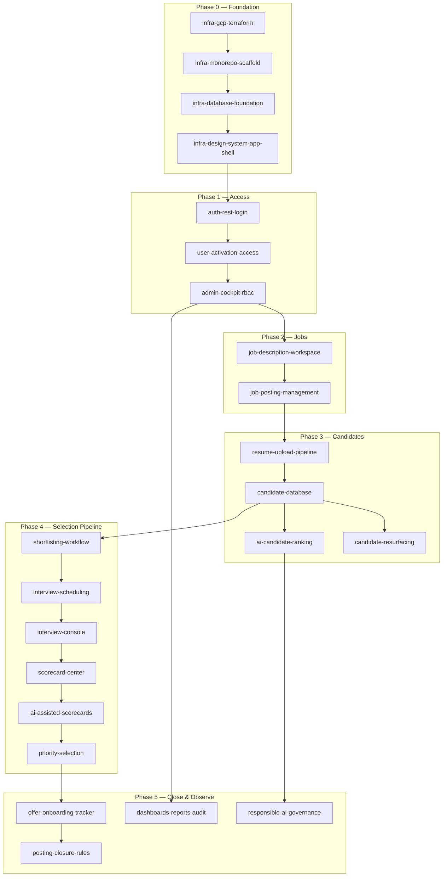

# HireSphere — Implementation Plan

This document defines how to build HireSphere from the [layout spec](../layout-spec.md) and [design spec](../design-spec.md). It covers infrastructure, database design, feature sequencing, and branch strategy.

**Scope exclusions (per product direction):**
- No Hubble SSO / Hubble login — authentication is username + password via REST API only.
- No Miracle branding — use HireSphere assets and tokens from the design spec only.
- Hubble ID is captured as an **external reference field** on offers/onboarding (feature 16), not as an auth provider.

**Documentation branch:** All planning documents and OpenSpec specs live on `feat/docs` under `docs/` and `openspec/`.

---

## 1. Recommended Stack

**Deployment platform: GCP.** Full infra detail in [gcp-infrastructure.md](./gcp-infrastructure.md).

| Layer | Choice | Rationale |
|---|---|---|
| Frontend | React 19 + TypeScript + Vite | Static build → GCS + Cloud CDN |
| Styling | Tailwind CSS v4 + CSS variables | Maps cleanly to design-spec tokens |
| API | Node.js (Fastify) on **Cloud Run** | Containerized REST API; autoscaling |
| Database | **Cloud SQL PostgreSQL** + Drizzle ORM | Managed HA Postgres; private IP |
| File storage | **Cloud Storage** (GCS) | Resume PDFs, exports; signed URLs |
| Auth | JWT (access + refresh) + bcrypt passwords | REST login; no external IdP |
| Background jobs | **Pub/Sub** + **Cloud Run Worker** | Resume scan/parse, AI batch, exports |
| Scheduled jobs | **Cloud Scheduler** → Pub/Sub | Posting closure reconcile, cleanup |
| AI | **Vertex AI** (Gemini) | JD drafting, ranking, scorecards, interview Qs |
| OCR | **Document AI** | Scanned PDF text extraction |
| Malware scan | ClamAV on Cloud Run or vendor API | Gate before parse/store |
| Resume parse | `pdf-parse` + structured extractor | Text extraction; OCR path for scans |
| Secrets | **Secret Manager** | DB creds, JWT keys, third-party API keys |
| IaC | **Terraform** (`infra/terraform/`) | Reproducible envs: dev, staging, prod |
| CI/CD | **Cloud Build** + GitHub triggers | Build, test, migrate, deploy |
| Audit | Append-only `audit_events` + `ai_run_logs` tables | Compliance and Responsible AI |

---

## 2. Repository Layout

```
HireSphere/
├── apps/
│   ├── web/                    # React SPA → GCS + Cloud CDN
│   └── api/                    # REST API → Cloud Run
│       └── src/routes/         # auth, admin, jobs, candidates, …
├── services/
│   └── worker/                 # Pub/Sub consumer → Cloud Run
├── packages/
│   ├── db/                     # Drizzle schema, migrations, seeds
│   ├── shared/                 # Types, validation (Zod), constants
│   └── ai-prompts/             # Versioned prompt templates (governance)
├── infra/
│   └── terraform/              # GCP IaC (modules + environments)
├── docker/                     # api, worker, migrate Dockerfiles
├── docs/                       # This branch — all planning docs
├── cloudbuild.yaml
├── layout-spec.md
└── design-spec.md
```

---

## 3. App Shell (from Layout + Design Specs)

Implement before feature UIs so every feature ships into a consistent shell.

| Shell state | Routes | Behavior |
|---|---|---|
| Bare/public | `/login`, shared read-only previews | No sidebar; 64px sticky header; theme toggle only |
| Authenticated | All app routes | Collapsible sidebar (224px / 56px), main scroll, optional floating panel |
| Presentation | Full-bleed content views | Chrome hidden |

**Sidebar nav (product-scoped, no product switcher unless multi-tenant later):**

| Nav item | Feature |
|---|---|
| Dashboard | 18 |
| Job Descriptions | 4 |
| Job Postings | 5, 17 |
| Candidates | 7, 9 |
| Shortlists | 10 |
| Interviews | 11, 12 |
| Scorecards | 13, 14 |
| Offers & Onboarding | 16 |
| Admin | 3 |
| Reports & Audit | 18 |
| AI Governance | 19 |

**Page templates:** browsable grid, detail split (280px rail), full-bleed — per layout-spec §4.2.

**Design tokens:** Implement all light/dark pairs from design-spec §1 as CSS variables; Plus Jakarta Sans + JetBrains Mono; sidebar stays fixed navy (not theme-toggled).

---

## 4. Database — Core Schema Overview

All features share these foundations. Detailed column-level DDL lives in `docs/database-schema.md`.

### 4.1 Identity & Access (features 1–3)

```
users
  id, username (unique), email, password_hash, status (pending|active|suspended|deactivated)
  activated_at, activated_by, last_login_at, created_at, updated_at

roles
  id, name, description, is_system

permissions
  id, resource, action          -- e.g. job_posting:create, scorecard:approve

role_permissions
  role_id, permission_id

user_roles
  user_id, role_id

page_action_matrix
  id, page_key, action_key, required_permission_id, description

activation_tokens
  id, user_id, token_hash, expires_at, used_at
```

### 4.2 Jobs (features 4–5, 17)

```
job_descriptions
  id, title, content_json, status (draft|in_review|approved|archived)
  created_by, approved_by, approved_at, version, parent_version_id

job_postings
  id, job_description_id, title, vacancy_type (finite|unlimited)
  vacancy_count (nullable for unlimited), filled_count, status (draft|open|on_hold|closed)
  is_evergreen, closed_at, closed_reason, created_by

posting_lifecycle_events
  id, posting_id, event_type, actor_id, payload_json, created_at
```

### 4.3 Candidates & Resumes (features 6–7, 9)

```
candidates
  id, canonical_email, canonical_phone, display_name, dedup_key
  status, created_at, updated_at

candidate_identities
  id, candidate_id, source, email, phone, name, confidence

resume_files
  id, candidate_id, blob_key, sha256, mime_type, size_bytes
  scan_status (pending|clean|infected|failed), parse_status, ocr_required
  uploaded_by, created_at

resume_versions
  id, candidate_id, resume_file_id, version_number, parsed_json, is_current

candidate_posting_links
  id, candidate_id, posting_id, source (upload|resurface|referral)
  stage, linked_at

candidate_history
  id, candidate_id, event_type, actor_id, payload_json, created_at
```

### 4.4 AI & Ranking (features 8, 14, 19)

```
ai_runs
  id, run_type, model_version, prompt_version_id, input_hash
  status, started_at, completed_at, token_usage, cost_estimate

ai_run_outputs
  id, ai_run_id, entity_type, entity_id, output_json, feedback_score

prompt_registry
  id, name, version, template, parameters_schema, status (draft|active|retired)
  approved_by, approved_at

ranking_results
  id, posting_id, candidate_id, ai_run_id, rank_score
  fitment_summary, gap_summary, interview_questions_json
```

### 4.5 Workflow (features 10–15)

```
shortlist_entries
  id, posting_id, candidate_id, reason (required), shortlisted_by, created_at

interview_tasks
  id, posting_id, candidate_id, assignee_id, status, due_at, scheduled_at

interview_rounds
  id, candidate_id, posting_id, round_number, interviewer_id, status

interview_notes
  id, round_id, version, content_structured_json, content_markdown
  ai_readable_json, author_id, created_at

scorecards
  id, round_id, candidate_id, status (draft|ai_generated|in_review|approved)
  scores_json, ai_run_id, approved_by, approved_at

priority_selections
  id, posting_id, candidate_id, rank_order (1–5), selected_by, created_at
  -- enforced: max 5 per finite posting via DB constraint + API guard
```

### 4.6 Offers & Closure (features 16–17)

```
offers
  id, candidate_id, posting_id, status, hubble_id (external ref, nullable)
  offer_date, accepted_at, onboarding_status, onboarding_checklist_json

posting_closure_rules
  id, posting_id, rule_type (auto_on_fill|manual), triggered_at
```

### 4.7 Observability (feature 18)

```
audit_events
  id, actor_id, action, resource_type, resource_id
  before_json, after_json, ip_address, user_agent, created_at

report_exports
  id, report_type, requested_by, status, blob_key, row_count, created_at
```

---

## 5. API Surface (REST)

Base path: `/api/v1`. All endpoints require auth except login and health.

| Domain | Key endpoints |
|---|---|
| Auth | `POST /auth/login`, `POST /auth/logout`, `POST /auth/refresh`, `GET /auth/me` |
| Users | `GET/POST/PATCH /users`, `POST /users/:id/activate`, `POST /users/:id/suspend` |
| RBAC | `GET/POST/PATCH /roles`, `GET/PUT /permissions/matrix` |
| JD | `GET/POST/PATCH /job-descriptions`, `POST /:id/submit-review`, `POST /:id/approve`, `POST /:id/ai-draft` |
| Postings | `GET/POST/PATCH /postings`, `POST /:id/open`, `POST /:id/close`, `POST /:id/hold` |
| Resumes | `POST /candidates/:id/resumes` (multipart), `GET /resumes/:id/status` |
| Candidates | `GET/POST /candidates`, `GET /:id/history`, `POST /dedup-check` |
| Ranking | `POST /postings/:id/rank`, `GET /postings/:id/rankings` |
| Resurface | `GET /postings/:id/resurface-candidates` |
| Shortlist | `POST/DELETE /postings/:id/shortlist` (reason required on POST) |
| Interviews | `GET/POST/PATCH /interview-tasks`, `POST /:id/schedule` |
| Notes | `GET/POST /interview-rounds/:id/notes`, version history |
| Scorecards | `GET/POST /scorecards`, `POST /:id/ai-generate`, `POST /:id/approve` |
| Priority | `PUT /postings/:id/priority-selections` (max 5) |
| Offers | `GET/POST/PATCH /offers`, `PATCH /:id/hubble-id` |
| Reports | `GET /dashboards/:key`, `GET /audit-events`, `POST /exports` |
| AI Gov | `GET/POST /prompts`, `POST /ai-runs/:id/feedback` |

---

## 6. Feature Branch Index

Branch naming convention: `infra/<slug>` for infrastructure, `feat/<slug>` for product features.

| # | Branch | Feature |
|---|---|---|
| — | `infra/gcp-terraform` | All GCP infra (Terraform): VPC, Cloud SQL, GCS, Cloud Run, Pub/Sub, LB/CDN, CI/CD, observability |
| — | `infra/monorepo-scaffold` | App monorepo, docker-compose local dev |
| — | `infra/database-foundation` | Drizzle setup, migrations, base seeds |
| — | `infra/design-system-app-shell` | Tokens, sidebar shell, routing, page templates |
| 1 | `feat/auth-rest-login` | REST username/password authentication |
| 2 | `feat/user-activation-access` | User activation and access enforcement |
| 3 | `feat/admin-cockpit-rbac` | Admin cockpit: users, roles, permissions, page/action matrix |
| 4 | `feat/job-description-workspace` | JD workspace with AI drafting and human approval |
| 5 | `feat/job-posting-management` | Postings with finite and unlimited vacancy support |
| 6 | `feat/resume-upload-pipeline` | PDF upload, validation, malware scan, parse, OCR, storage |
| 7 | `feat/candidate-database` | Candidates, dedup, resume versions, links, history |
| 8 | `feat/ai-candidate-ranking` | AI ranking, fitment/gap summaries, interview questions |
| 9 | `feat/candidate-resurfacing` | Existing-candidate resurfacing + selected-not-offered priority lane |
| 10 | `feat/shortlisting-workflow` | Shortlisting with mandatory reason capture |
| 11 | `feat/interview-scheduling` | Interview scheduling task workflow |
| 12 | `feat/interview-console` | Structured notes, rounds, versioning, AI-readable storage |
| 13 | `feat/scorecard-center` | Scorecard center (interviewed candidates only) |
| 14 | `feat/ai-assisted-scorecards` | AI scorecards with human review and approval |
| 15 | `feat/priority-selection` | Priority selection (up to 5 per finite vacancy) |
| 16 | `feat/offer-onboarding-tracker` | Offer and onboarding tracker with Hubble ID capture |
| 17 | `feat/posting-closure-rules` | Finite posting closure rules + evergreen manual controls |
| 18 | `feat/dashboards-reports-audit` | Dashboards, reports, audit logs, AI run logs, exports |
| 19 | `feat/responsible-ai-governance` | Prompt governance, model versioning, output feedback |

---

## 7. Implementation Phases & Dependencies



**Parallelization after Phase 1:** Features 4–5, 6–7, and 18 (skeleton) can proceed in parallel once RBAC lands. Feature 19 should start early (prompt registry) but full governance UI ships last.

---

## 8. Per-Branch Implementation Detail

### `infra/gcp-terraform` — all GCP infrastructure

Full detail in [gcp-infrastructure.md](./gcp-infrastructure.md). This is a **single branch** containing all Terraform, Dockerfiles, and Cloud Build config — intentionally bundled so you can learn Terraform end-to-end in one place.

**Directory layout (created on this branch):**

```
infra/terraform/
├── modules/
│   ├── networking/           VPC, PSA, VPC connector
│   ├── iam/                  Service accounts + IAM bindings
│   ├── secrets/              Secret Manager
│   ├── artifact-registry/    Docker repository
│   ├── cloud-sql/            PostgreSQL (private IP)
│   ├── storage/              GCS buckets
│   ├── pubsub/               Topics, subscriptions, scheduler
│   ├── cloud-run/            API, worker, migrate job
│   ├── load-balancer/        HTTPS LB + CDN
│   ├── observability/        Uptime checks, alerts
│   └── cicd/                 Cloud Build trigger
└── environments/
    ├── dev/
    ├── staging/
    └── prod/
```

**Also on this branch:** `docker/` (api, worker, migrate Dockerfiles), `cloudbuild.yaml`.

**Acceptance:** `terraform apply` in `environments/staging` provisions all resources; placeholder API returns 200 on `/api/v1/health`.

**Suggested implementation order within the branch** (one PR, logical commits):

1. Networking + IAM + secrets
2. Artifact Registry + Cloud SQL
3. Storage + Pub/Sub
4. Cloud Run (placeholder images)
5. Load Balancer + CDN
6. Observability + Cloud Build

---

### `infra/monorepo-scaffold`

**Goal:** Runnable empty app locally and deployable to GCP staging.

**Deliverables:**
- pnpm workspaces: `apps/web`, `apps/api`, `services/worker`, `packages/db`, `packages/shared`
- `docker-compose.yml`: local Postgres + Pub/Sub emulator
- Dockerfiles for api, worker, migrate
- `.env.example` with all required secrets documented
- Health endpoint: `GET /api/v1/health`
- Platform adapters: `StorageProvider` (GCS), `JobQueue` (Pub/Sub), `AIProvider` (Vertex AI)

**Secrets (Secret Manager in GCP; `.env.local` for dev):**
`DATABASE_URL`, `JWT_SECRET`, `JWT_REFRESH_SECRET`, `GCS_BUCKET_RESUMES`, `GCP_PROJECT_ID`, `MALWARE_SCAN_API_KEY`

---

### `infra/database-foundation`

**Goal:** Migration pipeline and seed data for local + preview branches.

**Deliverables:**
- Drizzle config + `packages/db/schema/`
- Tables: `users`, `roles`, `permissions`, `role_permissions`, `user_roles`, `audit_events`
- Migration: `0001_identity_audit.sql`
- Seed script: admin user, default roles (`admin`, `recruiter`, `hiring_manager`, `interviewer`, `viewer`)
- DB connection helper with Cloud SQL connector (prod) and direct TCP (local Docker)

**Acceptance:** `pnpm db:migrate && pnpm db:seed` succeeds locally; migrate Cloud Run Job succeeds in staging.

---

### `infra/design-system-app-shell`

**Goal:** Visual foundation matching both specs.

**Deliverables:**
- CSS variables for all design-spec color pairs (light/dark)
- Font loading: Plus Jakarta Sans, JetBrains Mono
- Button, badge, input, card components (6 button variants per design-spec §4.3)
- App shell: sidebar (224/56px collapse, persisted), main content padding, bare shell header
- Route guards (redirect unauthenticated → `/login`)
- Page header pattern, browsable grid, detail split templates
- Floating action panel component (empty state hidden until items exist)

**Acceptance:** Storybook or `/dev/shell` route demonstrating all three shell states and breakpoints.

---

### `feat/auth-rest-login` (Feature 1)

**Goal:** Username + password REST authentication.

**Backend:**
- `POST /api/v1/auth/login` — `{ username, password }` → `{ accessToken, refreshToken, user }`
- `POST /api/v1/auth/logout` — invalidate refresh token
- `POST /api/v1/auth/refresh`
- `GET /api/v1/auth/me`
- bcrypt (cost 12), rate limit (e.g. 5 attempts / 15 min / IP)
- JWT access (15 min) + refresh (7 days, rotated on use)

**Frontend:**
- `/login` on bare shell: username, password, submit, error states
- Token storage (httpOnly cookie preferred; document choice)
- Axios/fetch interceptor for 401 → refresh → retry

**DB:** Ensure `users.username` unique, `password_hash`, `last_login_at`.

**Tests:** Login success/failure, rate limit, token refresh, logout invalidates refresh.

---

### `feat/user-activation-access` (Feature 2)

**Goal:** Only activated users access the app; enforce at API and UI.

**Backend:**
- User `status` enum: `pending`, `active`, `suspended`, `deactivated`
- Auth middleware: reject non-`active` with 403 + reason code
- `POST /api/v1/users/:id/activate` (admin)
- `POST /api/v1/users/:id/suspend`, `POST /api/v1/users/:id/deactivate`
- Optional: `activation_tokens` for invite-link activation

**Frontend:**
- Pending users see blocked state if they somehow authenticate
- Admin can activate from user list (stub UI until feature 3)

**Acceptance:** Suspended user gets 403 on every API call; audit event written.

---

### `feat/admin-cockpit-rbac` (Feature 3)

**Goal:** Full admin UI for identity and authorization.

**Backend:**
- CRUD users (create sets `pending`, no self-activation)
- CRUD roles, assign permissions
- `GET/PUT /api/v1/permissions/matrix` — page × action grid
- Permission middleware: `requirePermission('job_posting:create')`

**Frontend (authenticated shell):**
- `/admin/users` — browsable grid + detail drawer
- `/admin/roles` — role editor with permission checkboxes
- `/admin/permissions` — page/action matrix table
- Sidebar "Admin" nav (gated by `admin:access`)

**Default matrix (seed):**

| Page | Actions | Default roles |
|---|---|---|
| job_descriptions | view, create, edit, approve | recruiter+, HM approves |
| job_postings | view, create, edit, close | recruiter+ |
| candidates | view, upload, edit | recruiter+ |
| shortlists | view, add, remove | recruiter+ |
| interviews | view, schedule, note | recruiter, interviewer |
| scorecards | view, create, approve | interviewer+, HM approves |
| offers | view, create, edit | recruiter+ |
| admin | access | admin only |
| reports | view, export | admin, recruiter lead |
| ai_governance | view, edit | admin only |

---

### `feat/job-description-workspace` (Feature 4)

**Goal:** AI-assisted JD drafting with human approval workflow.

**Backend:**
- JD CRUD with versioning (`parent_version_id`)
- Status machine: `draft` → `in_review` → `approved` → `archived`
- `POST /:id/ai-draft` — calls AI Gateway with governed prompt (feature 19 stub OK initially)
- `POST /:id/submit-review`, `POST /:id/approve` (requires `job_descriptions:approve`)
- Store content as structured JSON (sections: summary, responsibilities, requirements, nice-to-have)

**Frontend:**
- `/job-descriptions` — browsable grid with status badges
- Detail view: editor (main) + metadata rail (status, version, approver)
- AI draft button → streams or polls for result → user edits → submit for review
- Approved JDs are read-only; new version creates draft fork

**AI:** Log every run to `ai_runs` from day one (even before feature 19 UI).

---

### `feat/job-posting-management` (Feature 5)

**Goal:** Create and manage postings linked to approved JDs.

**Backend:**
- Posting CRUD; must reference `approved` JD
- `vacancy_type`: `finite` (requires `vacancy_count >= 1`) | `unlimited`
- Status: `draft`, `open`, `on_hold`, `closed`
- `filled_count` denormalized; updated by offer/priority features later
- `POST /:id/open` validates JD still approved

**Frontend:**
- `/postings` — grid with vacancy badge (e.g. "3/5" or "∞")
- Create flow: pick approved JD → set vacancy type/count → publish
- Detail: posting metadata rail + linked JD preview

---

### `feat/resume-upload-pipeline` (Feature 6)

**Goal:** Secure PDF ingest with validation, scan, parse, OCR readiness.

**Pipeline (background function):**

```
Upload → MIME/size check → store temp blob → malware scan
  → if infected: reject + audit
  → if clean: parse text → detect OCR need (low text density)
  → persist resume_files + resume_versions
```

**Backend:**
- `POST /api/v1/candidates/:id/resumes` — multipart, max 10MB, PDF only
- Validation: magic bytes, page count limit, password-protected PDF rejection
- Async status polling: `GET /resumes/:id/status`

**Storage:** GCS `hiresphere-resumes-{env}` bucket; private; V4 signed URLs (15 min TTL) for authorized download only.

**Frontend:**
- Upload dropzone on candidate detail
- Progress: uploading → scanning → parsing → ready/failed

**Security:** Never parse before scan passes; delete infected blobs immediately.

---

### `feat/candidate-database` (Feature 7)

**Goal:** Canonical candidate records with dedup, versions, links, history.

**Backend:**
- `POST /candidates` with dedup check (email exact, phone normalized, optional fuzzy name)
- Merge flow for suspected duplicates (admin/recruiter)
- `candidate_posting_links` when attached to a posting
- Append-only `candidate_history` on every stage change

**Frontend:**
- `/candidates` — browsable grid with search + filter chips
- Detail split: resume viewer, versions timeline, posting links, history feed
- Dedup warning modal on create/upload

**Dedup key:** `sha256(lower(email) | normalized_phone)`.

---

### `feat/ai-candidate-ranking` (Feature 8)

**Goal:** AI ranking and summaries per posting.

**Backend:**
- `POST /postings/:id/rank` — batch rank all linked candidates (background)
- Input: JD text + parsed resume JSON
- Output per candidate: `rank_score`, `fitment_summary`, `gap_summary`, `interview_questions_json`
- Store in `ranking_results` linked to `ai_run_id`

**Frontend:**
- Posting detail tab: "Rankings" sorted by score
- Expand row: fitment, gaps, generated questions
- Re-rank button (invalidates prior run, keeps history in `ai_runs`)

**Governance:** Use active prompt from `prompt_registry`; model version pinned per run.

---

### `feat/candidate-resurfacing` (Feature 9)

**Goal:** Surface existing candidates for new postings; priority lane for selected-not-offered.

**Backend:**
- `GET /postings/:id/resurface-candidates`
- Match: skills/title overlap (AI or rule-based), prior posting history
- Priority lane query: candidates with `stage = selected` AND no `offer.status = accepted` on prior postings
- Flag `source = resurface` on link creation

**Frontend:**
- Posting detail "Suggested candidates" panel
- Priority lane section with distinct badge (Warning status color)
- One-click add to posting (creates `candidate_posting_links`)

---

### `feat/shortlisting-workflow` (Feature 10)

**Goal:** Shortlist with mandatory reason.

**Backend:**
- `POST /postings/:id/shortlist` — body MUST include `reason` (min 10 chars)
- `DELETE /postings/:id/shortlist/:candidateId`
- Updates candidate stage + history event

**Frontend:**
- Shortlist action on candidate row → modal with required reason textarea
- `/shortlists` nav with count badge (sidebar)
- Floating panel option: multi-select shortlist with shared reason

---

### `feat/interview-scheduling` (Feature 11)

**Goal:** Task-based interview scheduling workflow.

**Backend:**
- `interview_tasks`: assignee, due date, status (`pending`, `scheduled`, `completed`, `cancelled`)
- `POST /:id/schedule` — set `scheduled_at`, notify assignee (email stub OK)
- Link task to `candidate_posting_links`

**Frontend:**
- `/interviews` — task queue (filter: mine, overdue, unscheduled)
- Schedule modal: datetime picker, interviewer, round number
- Task card → candidate detail link

---

### `feat/interview-console` (Feature 12)

**Goal:** Multi-round interviews with versioned structured notes.

**Backend:**
- `interview_rounds` per candidate+posting
- `interview_notes` with `version` increment on edit (never overwrite)
- `content_structured_json` schema: competencies[], strengths[], concerns[], recommendation enum
- `ai_readable_json` — normalized flat format for downstream AI (feature 14)

**Frontend:**
- `/interviews/:roundId` — full-bleed or detail console
- Round selector tabs
- Structured note form + markdown preview
- Version history sidebar (read-only older versions)

---

### `feat/scorecard-center` (Feature 13)

**Goal:** Scorecards only for interviewed candidates.

**Backend:**
- `GET /scorecards` — JOIN requires completed `interview_rounds`
- API guard: 403 if candidate has no completed interview for posting
- Scorecard templates (competency rubric per role level)

**Frontend:**
- `/scorecards` — grid filtered to interviewed-only (empty state explains gate)
- Entry from interview console "Create scorecard" CTA

---

### `feat/ai-assisted-scorecards` (Feature 14)

**Goal:** AI-generated scorecard drafts with human approval.

**Backend:**
- `POST /scorecards/:id/ai-generate` — input: interview notes (`ai_readable_json`) + JD
- Status: `ai_generated` → `in_review` → `approved`
- Human edits tracked; approval requires `scorecards:approve`

**Frontend:**
- Side-by-side: AI draft vs editable fields
- Approve / request changes flow
- Show AI run metadata (model, prompt version)

---

### `feat/priority-selection` (Feature 15)

**Goal:** Up to 5 priority candidates per finite vacancy.

**Backend:**
- `PUT /postings/:id/priority-selections` — array of `{ candidateId, rankOrder }`
- Validate: posting is `finite`, max 5, unique ranks 1–5, candidates on posting
- DB constraint + transaction lock to prevent race

**Frontend:**
- Posting detail "Priority picks" panel (only for finite)
- Drag-and-drop rank 1–5
- Floating panel integration for cross-page selection

---

### `feat/offer-onboarding-tracker` (Feature 16)

**Goal:** Offer lifecycle and onboarding with Hubble ID capture.

**Backend:**
- `offers` CRUD: status (`draft`, `extended`, `accepted`, `declined`, `withdrawn`)
- `hubble_id` — optional external employee ID string (not auth)
- `onboarding_checklist_json` — configurable steps with completion timestamps
- On `accepted`: increment `posting.filled_count`

**Frontend:**
- `/offers` — pipeline board or grid by status
- Offer detail: Hubble ID field (labeled "Hubble Employee ID"), onboarding checklist
- Link back to candidate + posting

---

### `feat/posting-closure-rules` (Feature 17)

**Goal:** Auto-close finite postings; manual evergreen controls.

**Backend:**
- Rule: when `finite` posting `filled_count >= vacancy_count` → auto `closed` with reason `vacancy_filled`
- Evergreen (`unlimited`): no auto-close; manual `POST /:id/close` only
- `posting_lifecycle_events` for every transition
- Scheduled function: reconcile stale `open` finite postings

**Frontend:**
- Close / hold actions on posting detail
- Closure history in metadata rail
- Warning when approaching fill limit

---

### `feat/dashboards-reports-audit` (Feature 18)

**Goal:** Operational visibility and compliance exports.

**Dashboards:**
- Recruiter: open postings, pipeline funnel, tasks overdue
- Hiring manager: approvals pending, scorecards awaiting review
- Admin: user activity, AI usage, storage

**Reports:**
- Posting funnel, time-to-fill, source effectiveness
- `POST /exports` — async CSV/PDF generation to Blobs

**Audit:**
- `/admin/audit` — searchable `audit_events` (actor, action, resource, date range)
- `/admin/ai-runs` — AI run log viewer (status, model, tokens, linked entity)

**Export controls:** Permission-gated; row-level redaction for PII based on role.

---

### `feat/responsible-ai-governance` (Feature 19)

**Goal:** Prompt governance, model versioning, feedback loop.

**Backend:**
- `prompt_registry` CRUD with version bump (draft → active → retired)
- Only one `active` version per prompt name
- All AI endpoints resolve prompt by name + active version
- `POST /ai-runs/:id/feedback` — thumbs + optional comment
- Model version string stored on every `ai_runs` row

**Frontend:**
- `/admin/ai-governance` — prompt list, version diff viewer, activate/retire
- Feedback widget on every AI-generated content panel
- Dashboard tile: feedback sentiment, runs by model version

**Prompts to register:**
- `jd_draft`, `candidate_rank`, `fitment_summary`, `gap_summary`, `interview_questions`, `scorecard_draft`

---

## 9. Cross-Cutting Concerns

### Security
- RBAC on every endpoint; never trust client-side nav hiding alone
- PII encryption at rest for `canonical_phone` (optional column-level)
- Signed blob URLs with short TTL
- CSRF protection if using cookies
- Input validation via Zod in `packages/shared`

### Testing Strategy
- Unit: permission middleware, state machines, dedup logic, priority cap
- Integration: auth flow, resume pipeline (mock scanner), ranking (mock AI)
- E2E (Playwright): login → create posting → upload resume → shortlist → interview → scorecard

### Deployment (GCP)
- Merge to `main` → Cloud Build deploys to **staging** automatically
- Tag `v*` → Cloud Build deploys to **prod** (manual approval gate)
- PR branches → Cloud Build runs lint/test/build only (no deploy)
- Feature branches merge to `main` in phase order; long-running branches rebase weekly
- See [gcp-infrastructure.md](./gcp-infrastructure.md) for full pipeline

---

## 10. Suggested Merge Order (Summary)

1. `infra/gcp-terraform`
2. `infra/monorepo-scaffold`
3. `infra/database-foundation`
4. `infra/design-system-app-shell`
5. `feat/auth-rest-login`
6. `feat/user-activation-access`
7. `feat/admin-cockpit-rbac`
8. `feat/responsible-ai-governance` *(prompt registry only — partial merge)*
9. `feat/job-description-workspace`
10. `feat/job-posting-management`
11. `feat/resume-upload-pipeline`
12. `feat/candidate-database`
13. `feat/ai-candidate-ranking`
14. `feat/candidate-resurfacing`
15. `feat/shortlisting-workflow`
16. `feat/interview-scheduling`
17. `feat/interview-console`
18. `feat/scorecard-center`
19. `feat/ai-assisted-scorecards`
20. `feat/priority-selection`
21. `feat/offer-onboarding-tracker`
22. `feat/posting-closure-rules`
23. `feat/dashboards-reports-audit`
24. `feat/responsible-ai-governance` *(full UI — final merge)*

---

## 11. Related Documents

| Document | Purpose |
|---|---|
| [../openspec/project.md](../openspec/project.md) | **OpenSpec** — requirements, scenarios, branch mapping |
| [feature-branches.md](./feature-branches.md) | Quick-reference branch list |
| [database-schema.md](./database-schema.md) | Table-level schema detail |
| [architecture.md](./architecture.md) | System context and data-flow diagrams |
| [gcp-infrastructure.md](./gcp-infrastructure.md) | GCP services, Terraform, CI/CD, environments |
| [../layout-spec.md](../layout-spec.md) | UI shell and layout |
| [../design-spec.md](../design-spec.md) | Visual design tokens |
